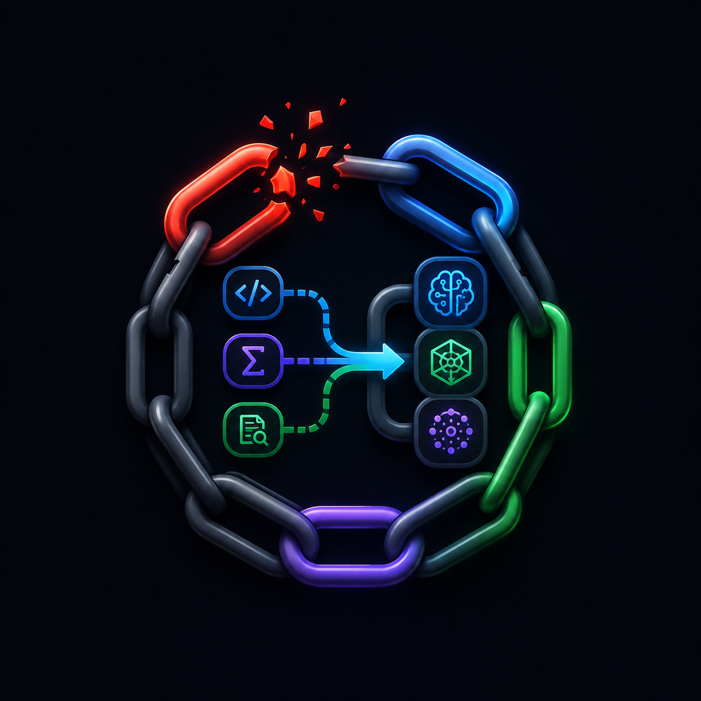

# ⛓ ChainForge

**Multi-model AI orchestration for VS Code.**

Chain any AI model via [OpenRouter](https://openrouter.ai). Route tasks automatically, fall back gracefully when a model fails, and never hit a dead end.



---

## ✨ Features

- **Smart Routing** — Assign tasks to the right model automatically
- **Auto Fallback** — If a model fails or hits token limit, the chain continues
- **Visual Editor** — Add, edit, delete agents and tasks without YAML
- **400+ Models** — Claude, GPT, Gemini, DeepSeek, MiniMax, GLM and more
- **Save to File** — Export AI responses directly to your workspace
- **7 Languages** — EN, TR, DE, FR, ES, JA, ZH
- **No Subscriptions** — Bring your own OpenRouter API key

---

## 🚀 Quick Start

1. Install **ChainForge** from VS Code Marketplace
2. Get a free API key from [openrouter.ai](https://openrouter.ai/keys)
3. Open Command Palette → `ChainForge: Open Panel`
4. Enter your OpenRouter key in **Settings** tab
5. Select a task type and start prompting

---

## 🔗 How It Works

ChainForge uses a **chain** of AI agents:

```
Task → Primary Agent → (if fails) → Fallback → Supervisor
```

Each agent has a model, role, retry count, and optional fallback. Configure everything through the visual panel.

---

## ⚙️ Configuration

ChainForge stores configuration in `.chainforge.json` in your workspace root.

```json
{
  "agents": {
    "worker": {
      "name": "AI Worker",
      "model": "minimax/minimax-m3",
      "role": "coding",
      "fallback": "fallback",
      "maxRetries": 3
    },
    "fallback": {
      "name": "Fallback",
      "model": "google/gemini-flash-1-5",
      "role": "fallback",
      "fallback": "supervisor",
      "maxRetries": 2
    },
    "supervisor": {
      "name": "Supervisor",
      "model": "anthropic/claude-sonnet-4-5",
      "role": "supervisor",
      "maxRetries": 1
    }
  },
  "tasks": {
    "coding": { "primary": "worker", "description": "Code writing, editing" },
    "review": { "primary": "supervisor", "description": "Code review" },
    "general": { "primary": "worker", "description": "General questions" }
  }
}
```

---

## 💎 Pro Features

| Feature | Free | Pro |
|---|:---:|:---:|
| Agents | 3 | Unlimited |
| Tasks | Unlimited | Unlimited |
| Visual editor | ✓ | ✓ |
| File export | ✓ | ✓ |
| Multi-provider API keys | — | ✓ |
| Priority support | — | ✓ |

[**Get Pro — $9.99 one-time →**](https://dodo.pe/yahnyvd3ig)

---

## 🤝 Contributing

Issues and PRs welcome. See [CONTRIBUTING.md](CONTRIBUTING.md).

## 📄 License

MIT — see [LICENSE](LICENSE)
